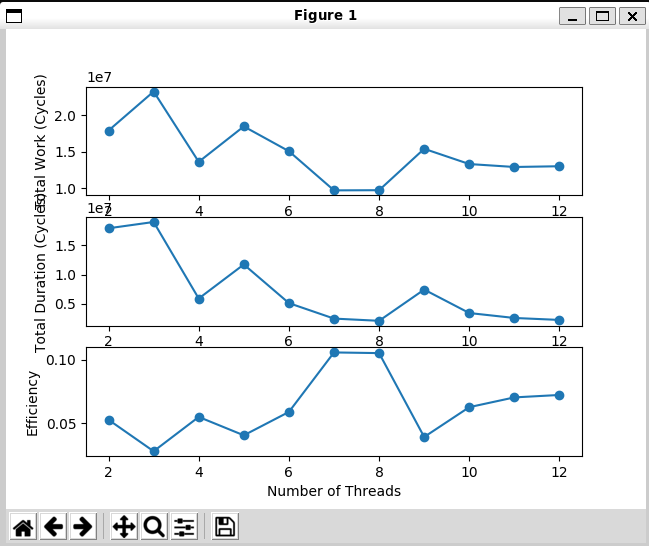
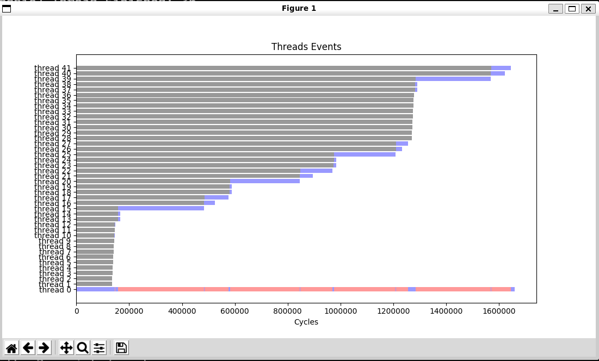

# PRAM Matrix Multiplication

This project explores parallel matrix multiplication algorithms within the PRAM model. Matrix multiplication is a fundamental numerical problem with applications in various domains, making it an essential topic in parallel computing.

## Problem Statement

The objective is to perform matrix multiplication for 9x9 matrices efficiently using a variable number of threads, denoted as 'p'. The goal is to distribute the computation such that each thread multiplies a portion of the input array with specific columns, and the final result is a multiplied matrix.

## Parallel Algorithms

### 1. PRAM Algorithm

In this algorithm, we leverage 'p' threads to perform the matrix multiplication in parallel. Each thread is responsible for multiplying a portion of the first array with the j-th column of the second array, where 'j' ranges from 0 to n/p. The threads then combine their results to construct the final matrix.

## Results

The results of the matrix multiplication are documented in the `mult_thread.txt` file. It showcases the correct assignment of threads, where 'p' threads are efficiently utilized to compute the product of the input matrices. The algorithm demonstrates scalability with an increase in the number of threads, resulting in improved performance up to a certain point. Beyond this break-even point, which corresponds to 'p' equaling the number of threads, the efficiency decreases.

  

  

## Usage

Follow the steps in "How to use PINocchio.txt".

## Acknowledgments

We would like to acknowledge the valuable insights and contributions from the parallel computing community. This project was inspired by discussions and research projects like "PINocchio" (https://github.com/albf/PINocchio), which have significantly contributed to our understanding of parallel processing techniques.

## Conclusion

Parallel matrix multiplication is a critical topic in parallel computing with applications in various domains. This project explores different PRAM-based algorithms and their performance characteristics. It serves as a foundation for understanding parallel computing techniques and their practical implications.

Feel free to explore the associated code and additional resources for a deeper understanding of parallel matrix multiplication.
